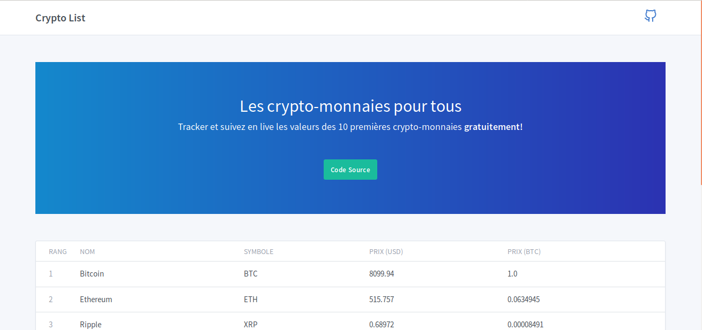

# crypto-list
> Simple application pour apprendre les fondammentaux du framework [Angular](https://angular.io).

> Learn [Angular](https://angular.io) fondammentals by building a simple cryptocurrency tracker.

> [GDG Porto-Novo Meetup](https://www.meetup.com/fr-FR/GDG-Porto-Novo/events/248765923/)



## Installation
```
  $ git clone git@github.com:nioperas06/crypto-list.git
  $ cd crypto-list
  $ npm install
  $ ng serve -o
```
Now open page http://127.0.0.1:8000/ in your browser and enjoy! 😎
